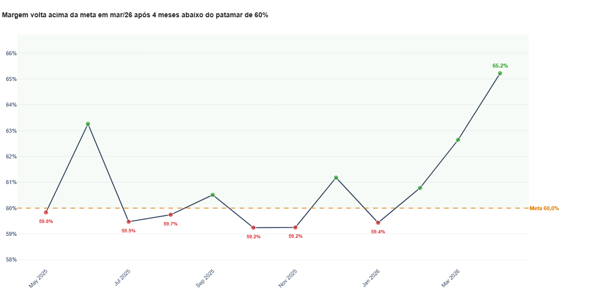
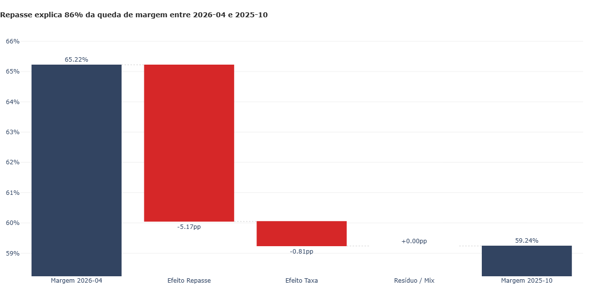

# Operational Efficiency vs Customer Value

Case analítico sobre eficiência econômica operacional a partir de ordens de serviço, mix de serviços, tipo de atendimento e regras de repasse.

## Resumo Executivo

Este projeto investiga uma pergunta comum em operações de serviço: crescer em receita significa, de fato, crescer com eficiência?

Usando dados sintéticos de ordens de serviço, o case mostra como volume, mix, repasse e forma de atendimento alteram a margem operacional ao longo do tempo. O foco não está em complexidade técnica, mas em como traduzir dados operacionais em decisões práticas de gestão.

## Problema de Negócio

Em operações baseadas em serviços, faturamento isolado é um indicador incompleto. Meses com maior receita podem esconder uma combinação menos eficiente de serviços, repasses mais altos e menor captura de valor para a operação.

A questão central deste case é:

**Quais combinações de serviços e atendimentos aumentam a carga operacional sem gerar ganho proporcional de eficiência econômica?**

## Perguntas Que a Análise Responde

- Quais períodos apresentam melhor e pior eficiência econômica?
- O aumento de receita veio acompanhado de melhora de margem?
- Quanto da piora de margem é explicado por repasse e taxas?
- Quais serviços e tipos de atendimento mudam o mix entre o melhor e o pior mês?
- Onde a operação parece estar trocando volume por qualidade de resultado?

## Contexto Dos Dados

- Base: ordens de serviço com cliente, data, valor, forma de pagamento, tipo de atendimento e serviço.
- Recorte analítico: visão mensal da operação.
- Regras aplicadas: cálculo de taxas por forma de pagamento, repasse por tipo de atendimento, lucro líquido, custo variável e margem.
- Observação: os dados publicados no repositório são sintéticos e servem apenas para demonstrar o raciocínio analítico.

## Metodologia

O fluxo da análise segue quatro etapas:

1. Extração das ordens de serviço a partir de SQL Server.
2. Tratamento e aplicação das regras de negócio para taxa, repasse e lucro líquido.
3. Agregação mensal de KPIs operacionais e econômicos.
4. Comparação entre melhor e pior mês para identificar o efeito de mix, repasse e tipo de atendimento.

Principais métricas usadas no case:

- `faturamento`: soma dos valores das ordens de serviço.
- `repasse`: parcela transferida conforme a regra de atendimento.
- `taxa`: custo associado ao meio de pagamento.
- `lucro`: valor retido pela operação após repasse e taxa.
- `custo_variavel`: soma de repasse e taxa.
- `margem`: lucro dividido pelo faturamento.
- `ticket`: média de valor capturado por atendimento no consolidado mensal.

## Principais Insights

- O maior faturamento não correspondeu ao melhor resultado operacional. Outubro de 2025 faturou `R$ 11.900`, mas registrou a pior margem do período, `59,24%`.
- Junho de 2025 teve faturamento bem menor, `R$ 4.827`, e ainda assim apresentou a melhor margem, `63,26%`.
- A decomposição entre o melhor e o pior mês indica que o aumento de repasse explica `84%` da queda de margem observada.
- O mês de pior margem concentrou mais receita em `Salão` (`97,31%` da receita) e operou com mix de serviços mais amplo, sem traduzir esse aumento de complexidade em melhor eficiência.
- O mix do pior mês sugere expansão de volume e variedade, mas com captura de valor inferior por composição operacional.

## Decisões De Negócio Sugeridas

- Revisar políticas de repasse e renegociar condições nos serviços que pressionam a margem.
- Priorizar serviços e combinações com melhor relação entre receita e captura de valor.
- Tratar meses de maior faturamento com análise de qualidade de receita, não apenas volume.
- Monitorar o mix por tipo de atendimento para evitar crescimento concentrado em operações menos eficientes.

## Visualizações-Chave

### Evolução Mensal Da Margem



### Decomposição Da Queda De Margem



## Estrutura Do Repositório

```text
operational-efficiency-vs-customer-value/
├─ README.md
├─ requirements.txt
├─ .env.example
├─ LICENSE
├─ notebooks/
│  └─ 01_operational_efficiency_case.ipynb
├─ outputs/
│  ├─ data/
│  └─ figures/
```

## Como Reproduzir

1. Clone o repositório.
2. Crie o arquivo `.env` a partir de `.env.example`.
3. Instale as dependências com `pip install -r requirements.txt`.
4. Abra o notebook [notebooks/01_operational_efficiency_case.ipynb](notebooks/01_operational_efficiency_case.ipynb).

## Limitações

- O material versionado usa dados sintéticos.
- O case atual mede eficiência econômica operacional; não há uma coluna explícita de horas por ordem no notebook publicado.
- A leitura de esforço por cliente é indireta, baseada em mix, valor, repasse e perfil de atendimento.

## Observação Sobre O Nome Do Repositório

O case foi reposicionado para o nome `operational-efficiency-vs-customer-value`. Se o repositório estiver publicado no GitHub, a troca efetiva do nome também precisa ser feita na interface do GitHub.
